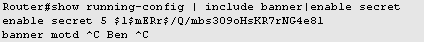
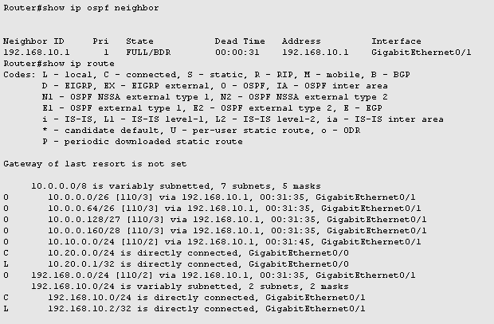

## Overview
Packet Tracer lab that recreates a small campus network from scratch. The design demonstrates Layer‑2 and Layer‑3 fundamentals, dynamic routing, network services and basic device hardening—skills expected from a junior system / network administrator.

## Topology

* **Routers:** 3 × Cisco 2911 in a linear chain (R1 ↔ R2 ↔ R3)  
* **Switch:** 1 × Catalyst‑style L2 switch  
* **Endpoints:**  
  * 8 PCs on the switch (2 per VLAN)  
  * 1 PC directly on R2  
  * 1 PC directly on R3  

## Addressing & VLAN Plan

| Link / VLAN | Network | Notes |
|-------------|---------|-------|
| R1–R2       | 192.168.0.0/24  | Point‑to‑point |
| R2–R3       | 192.168.10.0/24 | Point‑to‑point |
| R2–PC9      | 10.10.0.0/24    | Stand‑alone PC |
| R3–PC10     | 10.20.0.0/24    | Stand‑alone PC |
| VLAN 10 HR  | 10.0.0.0/26     | ≥ 60 hosts |
| VLAN 20 IT  | 10.0.0.64/27    | ≥ 40 hosts |
| VLAN 30 DEV | 10.0.0.96/28    | ≥ 20 hosts |
| VLAN 40 Sales | 10.0.0.112/28 | ≥ 10 hosts |

* VLSM used to carve the original `10.0.0.0/24` into four right‑sized subnets.  
* 802.1Q trunk between switch and R1, access ports per VLAN.  
* R1 sub‑interfaces act as default gateways (Router‑on‑a‑Stick).

## Key Features Implemented

* **Dynamic Routing:** Single‑area OSPFv2 with precise wildcard masks; full convergence verified.  
* **DHCP Services:** Router‑based pools per VLAN with the first 4 addresses excluded.  
* **Security Hardening:**  
  * Encrypted `enable secret`  
  * Login banner with author identification  
  * Unused interfaces administratively shut  
* **End‑to‑End Testing:** Successful pings across VLANs, across routers, and to stand‑alone PCs.

# Configuration Snapshots

## VLAN & Trunk Configuration
Shows creation of VLANs 10–40 and proper trunking between switch and R1.
Ports Fa0/1–Fa0/8 are assigned as access ports to HR, IT, DevOps, and Sales VLANs.

## R1 Subinterfaces (Router-on-a-Stick)
Encapsulation and gateway IPs defined per VLAN on R1.

## DHCP Bindings
Demonstrates successful IP assignment to VLAN hosts from router-based DHCP pools.

## Security Hardening
Includes encrypted enable secret and custom login banner on R1.

## OSPF Neighbor Adjacency & Routing Tables
Full adjacency and routing across R1–R2–R3 using OSPF.

## End-to-End Connectivity
PC1 pings PC in another VLAN, PC9 (R2), and PC10 (R3). Routing confirmed.

